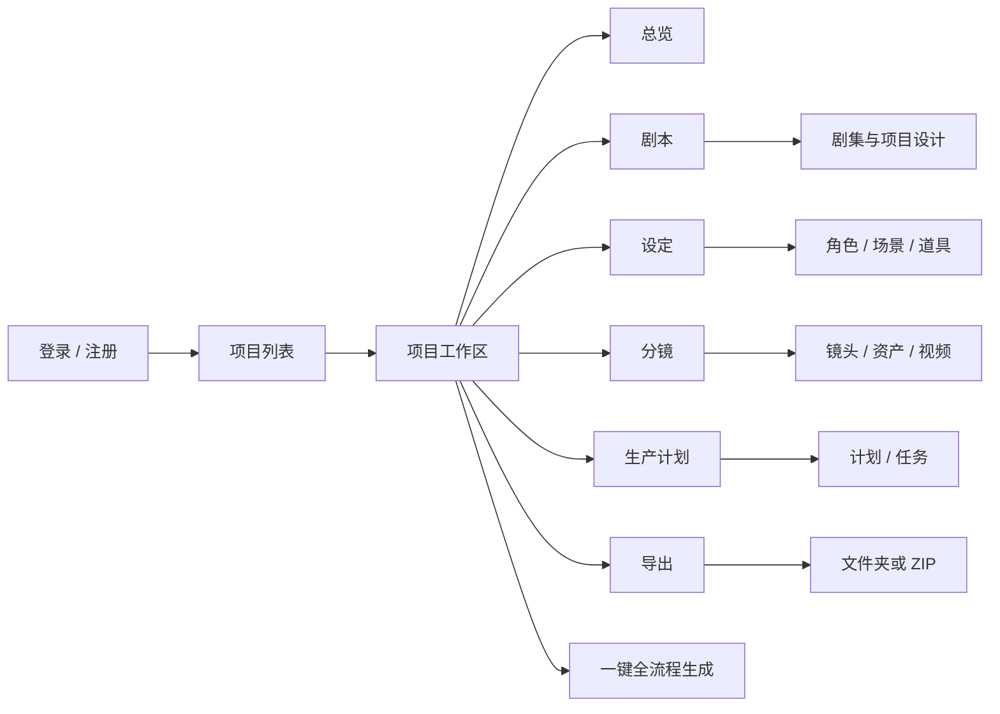
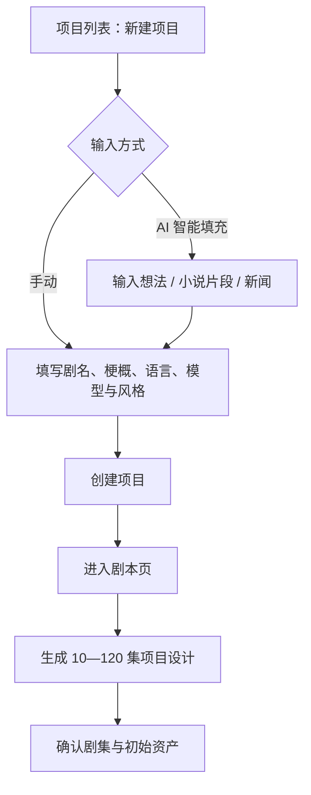
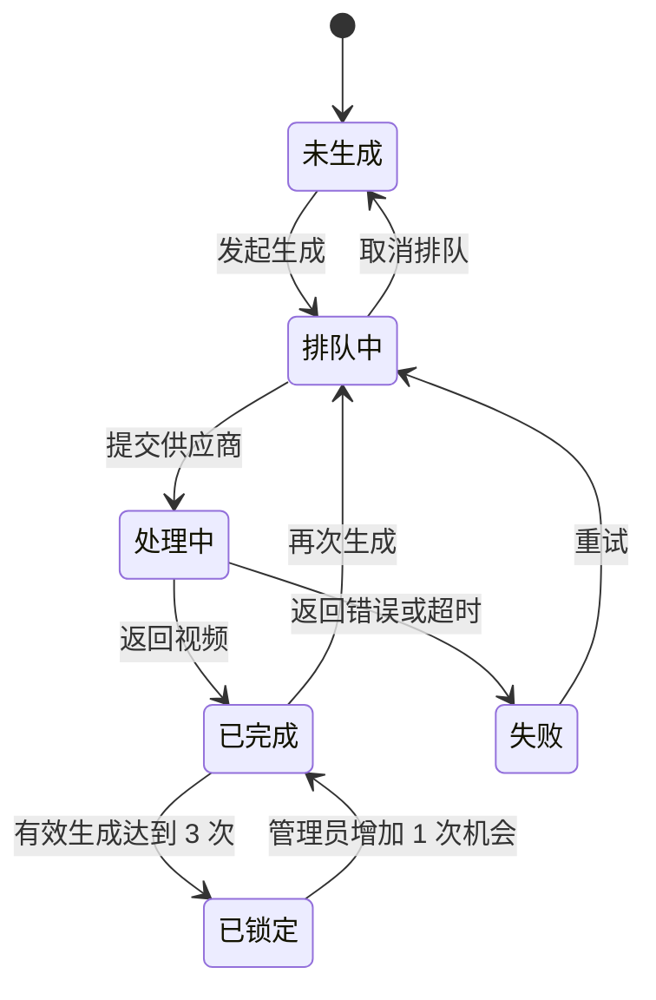

# Inkplot Workshop UI/UX 产品需求说明

> 文档用途：提供给 UI/UX 设计人员，作为信息架构、用户流程、页面设计、组件状态和交互原型的直接输入。  
> 事实基线：当前代码 `main@6f197b0`  
> 核对日期：2026-07-15  
> 文档性质：现状产品设计说明；“建议优化”不代表当前代码已经实现。

## 1. 设计任务摘要

Inkplot Workshop 是一个 AI 短剧生产工作台。用户需要在同一个项目中完成：

1. 从故事灵感生成多集项目设计；
2. 生成、编辑和管理各集剧本；
3. 提取角色、场景、道具并生成设定图；
4. 把剧本转换为结构化分镜；
5. 为分镜关联参考资产并生成视频；
6. 通过生产计划持续推进长任务；
7. 导出剧本、设定、分镜、视频和元数据。

UI/UX 的核心挑战不是单页美化，而是让用户理解并控制一条耗时长、成本高、会覆盖数据、可能部分失败的 AI 生产链路。

## 2. 体验目标

### 2.1 核心体验原则

- **阶段明确**：用户始终知道自己位于“项目 → 剧本 → 设定 → 分镜 → 视频 → 导出”的哪个阶段。
- **结果可控**：AI 生成结果必须允许预览、选择、修改、重试或跳过。
- **风险透明**：覆盖、删除、高成本批量生成、完全重传等操作必须在执行前说明影响范围。
- **长任务可理解**：显示阶段、进度、成功数、失败数、排队状态和下一步行动。
- **一致性优先**：项目画面风格、模型和资产引用应在各模块保持一致。
- **专业但克制**：视觉气质延续东方编辑感，以留白、清晰层级和低饱和中性色为主。

### 2.2 设计成功标准

- 新用户无需阅读说明即可理解六个项目主模块的先后关系；
- 用户能够分辨“尚未生成、排队中、处理中、已完成、失败、已锁定”；
- 任何覆盖或高成本操作都不会因信息不足而误触；
- 批量任务局部失败后，用户知道哪些成功、哪些失败以及如何继续；
- 用户能在导出前判断项目是否完整。

## 3. 目标用户

### 3.1 短剧创作者 / 编剧

主要关注故事结构、分集概要、剧本文本和人物设定。其工作频率高，但不一定了解模型、队列或供应商术语。

### 3.2 制片 / 视觉内容运营

主要关注资产图片、分镜提示词、视频生成、失败重试、批量进度和最终交付。

### 3.3 系统管理员

主要关注跨项目队列、异常任务、生成次数、失败恢复和全站数据管理。

当前产品没有团队协作、成员邀请或项目内角色权限，因此普通用户界面按“单人拥有项目”设计。

## 4. 信息架构

### 4.1 全局导航

桌面端项目内采用左侧固定导航：

| 顺序 | 导航项 | 用户心智 | 当前路由 |
|---|---|---|---|
| 1 | 总览 | 看项目状态与封面 | `/project/[id]/overview` |
| 2 | 剧本 | 生成和编辑故事内容 | `/project/[id]` |
| 3 | 设定 | 管理角色、场景、道具 | `/project/[id]/assets` |
| 4 | 分镜 | 将剧本转为镜头并生成视频 | `/project/[id]/storyboard` |
| 5 | 生产计划 | 让系统持续批量推进 | `/project/[id]/production` |
| 6 | 导出 | 检查并打包项目 | `/project/[id]/export` |

“一键全流程生成”是跨模块主操作，不属于单独页面，位于项目导航中。

### 4.2 建议导航表达

- 保留模块名称，同时增加轻量完成状态，例如“剧本 20/52”“设定 18/24”“视频 63/430”；
- 明确区分页面导航和全局批量操作，避免“一键全流程生成”看起来像普通导航项；
- 移动端改为顶部项目栏加横向阶段导航或抽屉导航，不建议直接压缩桌面侧边栏。

## 5. 关键用户流程

### 5.1 从零创建项目

设计重点：

- 新建项目字段较多，应按“故事信息 / 视觉风格 / 模型与视频 / 高级设置”分组；
- AI 智能填充是降低填写成本的辅助入口，不应让用户误以为点击后立即创建项目；
- 火山素材库 ID 等供应商配置应放在高级设置，默认折叠；
- 创建前应能看到当前图像模型、视频模型和画幅的摘要。

### 5.2 剧本到资产

设计重点：提取结果必须让用户看见资产类型、名称、描述、关联剧集、图片状态以及是否已存在。

### 5.3 分镜到视频

设计重点：视频状态、生成次数与失败原因必须同时可见；“排队中”和“处理中”不能只使用相近的加载动画区分。

### 5.4 导出流程

导出项目 → 获取项目数据 → 展示完整性总览 → 标出缺封面/缺图/缺视频 → 用户确认 → 选择本地目录；不支持目录写入时回退 ZIP → 显示打包进度 → 完成。

## 6. 页面清单

| 页面 | 主要目标 | 核心操作 | 必须设计的状态 |
|---|---|---|---|
| 登录/注册 | 建立用户会话 | 登录、注册、忘记密码 | 默认、提交中、错误、邮件已发送 |
| 项目列表 | 找到或创建项目 | 新建、进入、编辑、删除、同步 | 加载、空列表、删除确认、接口失败 |
| 新建/编辑项目 | 配置生产参数 | AI 填充、保存 | 生成中、字段校验、兼容提示、保存失败 |
| 项目总览 | 判断整体完成度 | 生成封面、切换候选、编辑图片 | 加载、无数据、生成中、部分完成、错误 |
| 剧本页 | 管理多集文本 | 项目设计、单集/批量生成、续写、增删剧集 | 自动保存、覆盖确认、批量进度、部分失败 |
| 设定集 | 管理资产与图片 | 提取、筛选、生图、编辑、同步 | 空分类、缺图、处理中、同步失败、搜索无结果 |
| 分镜页 | 管理镜头与视频 | 生成、编辑、排序、关联资产、生成视频 | 无分镜、生成进度、五类视频状态、锁定 |
| 生产计划 | 配置后台长任务 | 创建、立即运行、暂停、恢复 | 无计划、无任务、失败任务、计划完成 |
| 导出页 | 打包项目 | 预检、确认、导出 | 数据获取中、缺失提示、打包中、完成、失败 |
| 管理后台 | 运维与恢复 | 刷新、恢复、清理、解禁 | 队列为空、任务异常、危险操作确认 |

## 7. 页面级设计需求

## 7.1 登录与注册

### 页面结构

- 品牌标题与简短价值描述；
- “登录 / 注册”双标签；
- 登录：邮箱、密码、提交；
- 忘记密码：邮箱和发送重置入口；
- 注册：邮箱、密码、提交。

### 交互要求

- 登录、注册和忘记密码三类反馈不可共用一个模糊提示区；
- 错误信息应靠近对应表单，并保留用户已输入的邮箱；
- 提交中禁止重复点击，但不应清空表单；
- 注册成功明确说明“需要邮箱验证”，而不是直接表现为已登录。

## 7.2 项目列表

### 页面结构

- 顶部：产品名、退出登录、新建项目；
- 内容：最近项目数量、同步入口、项目卡片网格；
- 项目卡片：剧名、语言、梗概、图像模型、类型标签、更新时间；
- 卡片二级操作：编辑、删除。

### 设计要求

- 卡片主体点击进入项目，二级操作必须有独立点击区域；
- 删除确认展示项目名称，并说明会级联删除剧本、设定和分镜；
- 空状态应以“新建项目”为唯一主行动；
- 移动端不依赖 hover 显示编辑/删除入口。

## 7.3 新建/编辑项目弹窗

### 推荐分组

1. **故事信息**：AI 智能填充、剧名、梗概、语言；
2. **画面风格**：三种画面预设、人物美术、场景美术；
3. **生成模型**：图像模型、视频模型、视频画幅；
4. **高级设置**：火山素材库同步、素材组 ID、项目名。

### 当前字段

| 字段 | 类型 | 默认值/规则 |
|---|---|---|
| 剧名 | 单行文本 | 必填 |
| 梗概 | 多行文本 | 可选，但一键流程依赖 |
| 语言 | 单选 | 中文 |
| 图像模型 | 单选 | Gemini 3 Pro Image |
| 画面风格 | 卡片单选 | 国内真人剧 |
| 人物/场景美术 | 文本 | 可选补充 |
| 视频模型 | 单选 | 服务端默认 |
| 视频画幅 | 单选 | 9:16 |
| 火山素材同步 | 开关 | 关闭 |

### 交互风险

- 表单高度超过普通弹窗，应保持标题和底部保存操作固定，中间内容滚动；
- 历史项目自动推断风格时，用说明提示，不应表现成校验错误；
- 用户切换为 Seedance 2.0 后，应解释素材同步与 Active 状态的关系；
- 梗概为空时，在创建前提示“一键全流程生成将无法自动生成项目设计”。

## 7.4 项目总览

### 页面信息层级

1. 项目标题语境：梗概、类型、更新时间；
2. 智能封面；
3. 总剧集、总资产、分镜数、已完成视频；
4. 剧本、资产配图、视频三类进度；
5. 项目风格与敏感词设置摘要。

### 智能封面组件

- 空状态：生成封面设计；
- 已有文案无图片：显示标题、Slogan、Prompt 和“生成封面图”；
- 生成中：保留当前内容，覆盖局部加载层；
- 生成完成：主图加四张候选缩略图；
- 编辑态：输入修改要求并生成四张新候选；
- 错误态：显示可读错误及重试入口。

封面生成分为“生成文案/提示词”和“根据提示词生图”两个阶段，界面必须让用户理解这不是一个按钮完成的同一件事。

## 7.5 剧本页

### 桌面布局

- 左侧二级栏：剧集列表、新增、删除；
- 主区顶部：当前集标题、保存状态和 AI 操作；
- 主区正文：富文本编辑器。

### 顶部操作优先级

1. 生成项目设计；
2. 生成当前集剧本；
3. 一键生成全部剧本；
4. AI 续写。

建议不要把四个操作设计成同权重按钮：项目设计会覆盖全部剧集与资产，风险最高；AI 续写只作用于当前正文，范围最小。

### 必须表现的状态

- 自动保存：已保存、保存中、有未保存更改、保存失败；
- 项目设计：生成项目圣经、分批生成大纲、保存剧集与资产；
- 批量剧本：当前数/总数、失败数；
- 当前集没有概要时，“生成剧本”不可用并说明原因；
- 删除剧集需确认，且提示相关分镜会级联删除。

### 覆盖确认

“生成项目设计”会删除当前全部剧集和资产。确认弹窗必须包含：

- 将被删除的剧集数和资产数；
- 新目标集数；
- 不可撤销说明；
- 明确的危险操作按钮文案，例如“覆盖并重新生成”。

## 7.6 设定集

### 页面结构

- 顶部：角色/场景/道具统计、图像模型、批量生图、从剧本提取；
- 火山素材同步状态区；
- 分类标签：角色、场景、道具；
- 剧集筛选、搜索；
- 瀑布流资产卡片。

### 资产卡片

卡片至少展示：

- 图片或类型占位图；
- 名称；
- 核心主角标记；
- 简短描述；
- 关联剧集；
- 素材同步状态；
- 快速生图/重新生成；
- 删除入口。

### 素材同步状态建议

| 状态 | 表达 | 下一步 |
|---|---|---|
| 无图片 | 中性灰 | 先上传或生成图片 |
| 未同步 | 中性灰 | 重新同步 |
| 已提交/处理中 | 蓝色 | 刷新状态或谨慎重试 |
| Active | 绿色 | 可用于 Seedance |
| Failed | 红色 | 展示失败原因并重试 |

不要只用颜色区分，必须同时显示文本或图标。

### 资产编辑弹窗

字段包括名称、核心主角、描述、视觉提示词、关联剧集、图片上传/URL/生成和预览。

建议将“视觉提示词”和“图片结果”放在同一视觉区域；关联剧集使用可搜索多选，不宜在 50+ 集项目中平铺全部复选框。

## 7.7 资产提取预览

### 设计目标

让用户在写入资产库前完成筛选、识别和补图。

每个结果展示：勾选、类型、名称、描述、视觉提示词、关联剧集、图片状态、单项生图。顶部提供全选、取消全选和批量生图。

需要区分：

- 新发现资产；
- 已存在而被跳过的资产；
- 同名合并后关联多集的资产；
- 生图失败但仍可导入文字信息的资产。

## 7.8 分镜页

### 桌面布局

- 左侧：剧集列表；
- 顶部：镜头数、总时长、查看剧本、生成当前集分镜、生成全部分镜、生成当前集视频、新增镜头；
- 主区：纵向分镜卡片列表。

### 分镜卡片信息建议

1. 镜头编号、时长、景别、运镜；
2. 场景、动作、情绪、光影、声音；
3. 视频提示词；
4. 关联资产；
5. 视频结果或状态；
6. 编辑、复制、导出、降敏、删除等辅助操作。

当前信息密度高，建议使用“常用摘要 + 展开详细信息”，不要在默认态平铺所有字段。

### 分镜生成

- 第一阶段：“正在规划镜头数量”；
- 长剧本：“正在分段规划 X/Y”；
- 第二阶段：“正在逐镜头生成 X/Y”；
- 批量生成：“已完成剧集 X/Y，失败 N 集”。

重新生成会覆盖当前集已有分镜，必须显示已有镜头数。

### 分镜编辑

- 支持拖拽排序，并在保存成功前提供反馈；
- 修改序号导致整体重排时，需清楚提示结果；
- 资产选择区分已选/未选，支持搜索；
- 当前镜头最多显示三个“出场角色”描述，但关联资产数量当前无硬限制；
- 复制资产后，应有全局可见的“已复制镜头 #N 的 X 个资产”状态和清除入口。

## 7.9 视频生成

### 状态组件

每个镜头的视频区域统一展示：

- 当前状态；
- 队列位置（如可用）；
- 本次开始时间或已耗时；
- 已用次数/允许次数；
- 失败原因；
- 生成、取消、重试、查看历史或联系管理员等下一步操作。

### 状态对应操作

| 状态 | 主操作 | 次操作 |
|---|---|---|
| 未生成 | 生成视频 | 编辑提示词 |
| 排队中 | 查看队列 | 取消排队 |
| 处理中 | 等待 | 查看任务信息 |
| 已完成 | 播放/下载 | 再次生成、查看历史 |
| 失败 | 重试 | 查看错误、修改提示词 |
| 已锁定 | 联系管理员 | 查看历史 |

### 高成本批量确认

“生成当前集视频”和“一键全流程”的视频阶段，应展示：

- 待生成镜头数；
- 已完成、排队中、处理中和锁定的镜头数；
- 预计使用的模型、画幅和时长；
- 将跳过的镜头及原因；
- 明确的成本提示。

## 7.10 生产计划

### 创建计划

表单分为三步更易理解：

1. 处理什么：集数范围、生产模式；
2. 什么时候运行：手动、一次、每天、间隔；
3. 如何处理已有内容：跳过已有分镜、自动排队视频、立即执行。

右侧计划预览实时总结生产范围、节奏、执行边界、启动方式和视频策略。

### 计划卡片

展示名称、状态、模式、触发方式、集数进度、下一集游标、上下次执行时间、立即运行和暂停/恢复。

计划状态不能只显示 active/paused 英文内部值，应使用“运行中、已暂停、已完成、失败”。

### 最近任务

表格包含任务类型、状态、尝试次数、时间和错误。失败错误不应只截断；支持 hover、展开或详情抽屉查看完整内容。

## 7.11 导出页

当前入口较简单，建议把导出设计成“完整性检查 → 内容清单 → 导出”三阶段。

### 完整性总览

- 项目封面：已设置/未设置；
- 分集数量；
- 资产总数与缺图数；
- 分镜总数与缺视频数；
- 清楚说明缺失资源不会阻断导出。

### 导出进度

应显示当前阶段，例如封面、剧本、设定图、分镜媒体、分镜文档、元数据、ZIP，并提供总体百分比。

浏览器不支持目录保存时，用正常产品文案提示“将改为下载 ZIP”，避免显示技术性 fallback 信息。

## 7.12 一键全流程生成

### 弹窗结构

- 标题与预计执行内容；
- 阶段进度条；
- 可滚动的逐步日志；
- 当前阶段、完成比例、失败项；
- 开始、重试、完成刷新按钮。

### 阶段

1. 项目设计；
2. 缺失剧本；
3. 资产图片；
4. 分镜脚本；
5. 视频任务。

视频阶段需要第二次确认。若用户取消视频生成，应表达为“已完成到分镜阶段”，不应使用“流水线暂停”造成任务仍在后台运行的误解。

## 8. 全局组件与状态规范

### 8.1 按钮层级

- Primary：当前页面最重要且安全的下一步；
- Secondary：同级辅助操作；
- Ghost/Icon：局部、低频操作；
- Destructive：删除、覆盖、清空、完全重传；
- Loading：保留原按钮宽度，显示动作中的具体文案。

一个操作区原则上只保留一个 Primary。批量生成、覆盖和删除不要同时使用同样的黑色主按钮。

### 8.2 状态颜色

| 语义 | 建议颜色 | 用途 |
|---|---|---|
| 中性 | 灰 | 未开始、未同步、无数据 |
| 信息 | 蓝 | 排队、处理中、生成中 |
| 成功 | 绿 | Active、已完成、已保存 |
| 警告 | 琥珀 | 资源缺失、可能重复、成本提醒 |
| 错误 | 红 | 失败、不可用、危险操作 |

颜色必须与文字、图标或形状同时使用。

### 8.3 加载态

- 首次页面加载：骨架屏或稳定占位，避免只在页面中央放旋转图标；
- 局部生成：保留旧结果，覆盖局部加载层；
- 批量任务：确定型进度条加当前数/总数；
- 无法计算进度：使用阶段型进度，不伪造百分比。

### 8.4 空状态

每个空状态必须包含：发生原因、下一步主操作、可选学习说明。

示例：

- 无剧本：生成项目设计或手动编写；
- 无资产：从剧本提取或手动添加；
- 无分镜：AI 生成或手动添加；
- 无生产计划：创建第一条计划；
- 搜索无结果：清除搜索或切换剧集筛选。

### 8.5 错误态

错误提示至少包含：用户可理解的原因、影响范围、是否已保存已有结果、可执行的下一步。供应商原始错误可放入“技术详情”，不直接作为唯一提示。

## 9. 响应式策略

### 9.1 桌面端（≥ 1280px）

- 保留项目侧边栏和页面内二级栏；
- 剧本、分镜采用多栏工作台布局；
- 大型表格和资产选择器完整展示。

### 9.2 平板端（768—1279px）

- 项目侧边栏可折叠；
- 剧集列表可改为顶部横向列表或抽屉；
- 分镜详细编辑由左右双栏改为主内容加资产抽屉；
- 工具栏允许分组换行，不压缩按钮文案。

### 9.3 手机端（< 768px）

- 项目导航使用抽屉或阶段菜单；
- 优先支持查看、简单编辑、状态跟踪和审批式操作；
- 复杂分镜字段、批量资产选择和生产计划创建可进入全屏表单；
- 所有 hover 操作必须有常驻或点按替代方案；
- 不使用固定 400px 侧栏。

## 10. 文案规范

### 10.1 面向用户的状态词

- pending：未生成；
- queued：排队中；
- processing：处理中；
- completed：已完成；
- failed：失败；
- active（计划）：运行中；
- paused：已暂停。

### 10.2 危险操作文案

避免只写“确定继续吗”。应写清对象和后果，例如：

> 将删除当前 52 集剧本、24 个资产及其关联分镜，然后重新生成项目设计。此操作无法撤销。

### 10.3 AI 生成文案

区分“生成”“重新生成”“覆盖并生成”“重试失败项”“继续未完成任务”，不要全部使用“一键生成”。

## 11. 可访问性要求

- 所有表单具有可见 Label、错误关联和键盘焦点；
- 图标按钮必须有文字提示或 `aria-label`；
- 图片提供有意义的替代文本；
- 视频提供键盘可操作的播放控件；
- 状态不能只依赖颜色；
- 弹窗打开后管理焦点，关闭后返回触发按钮；
- 拖拽排序提供键盘或按钮式替代操作；
- 正文与背景、次要文字与背景满足可读对比度。

## 12. 当前体验问题与设计优先级

### P0｜必须先解决

- 一键全流程视频画幅固定为 9:16，与项目 16:9 配置可能冲突；
- 高成本视频批量操作缺少镜头数、预计用量和跳过项摘要；
- 覆盖全部剧集/资产的项目设计操作提示不足；
- 多处仍使用浏览器原生 `alert/confirm`，无法承载完整风险说明；
- 视频、素材同步和生产任务的状态语言不统一。

### P1｜主流程优化

- 统一所有批量任务的进度、成功/失败汇总与重试模式；
- 建立统一的 AI 生成结果选择和版本候选交互；
- 将分镜卡片从全量信息平铺改为摘要加展开；
- 让普通用户看到按集失败原因并自行重试；
- 设计资产锁定及核心主角最多两个的明确交互。

### P2｜体验完善

- 建立项目级生成日志和成本/用量视图；
- 优化移动端分镜、资产选择和生产计划；
- 将技术错误、供应商 ID 和内部状态移入详情层；
- 为内流控制、角色冲突与导演意图预留未来信息架构位置，但当前不进入主导航。

## 13. UI/UX 交付建议

设计交付至少包含：

1. 全局信息架构与桌面/移动导航；
2. 从零创建、剧本到资产、分镜到视频、生产计划、导出五条任务流；
3. 项目列表、新建项目、总览、剧本、设定、提取预览、分镜、视频状态、生产计划、导出页面高保真稿；
4. 覆盖、删除、高成本生成、完全同步等确认弹窗；
5. AI 生成、队列、处理、失败、完成、锁定的统一状态组件；
6. 空态、加载态、部分失败态、权限/网络错误态；
7. 响应式断点行为说明；
8. 组件命名、状态枚举、交互说明和验收标注。

## 14. 设计验收清单

- [ ] 用户能从导航理解模块顺序和项目当前进度；
- [ ] 所有页面均包含加载、空、错误和完成状态；
- [ ] 覆盖性操作显示影响数量与不可撤销说明；
- [ ] 视频状态和下一步操作一一对应；
- [ ] 批量任务显示成功数、失败数和重试入口；
- [ ] 移动端不依赖 hover 或固定侧栏；
- [ ] 表单长内容具有固定标题/操作区和可滚动正文；
- [ ] 颜色之外还有文本或图标表达状态；
- [ ] 技术术语均有用户语言或解释；
- [ ] 关键流程在 10 集和 52 集规模下均经过原型验证。

## 15. 代码事实索引

| 设计主题 | 主要代码来源 |
|---|---|
| 项目导航 | `src/components/layout/Sidebar.tsx` |
| 项目列表/表单 | `ProjectList.tsx`、`ProjectDialog.tsx` |
| 项目总览与封面 | `ProjectOverview.tsx`、`ProjectCoverCard.tsx` |
| 剧本 | `src/components/editor/ScriptEditor.tsx` |
| 资产与提取 | `AssetGallery.tsx`、`AssetDialog.tsx`、`ExtractionPreviewDialog.tsx` |
| 分镜与视频 | `StoryboardEditor.tsx`、`ShotCard.tsx`、`ShotDetailDialog.tsx` |
| 一键全流程 | `OneClickWorkflowDialog.tsx` |
| 生产计划 | `ProductionPlansPage.tsx` |
| 导出 | `ExportPanel.tsx` |
| 状态与业务规则 | `duration.ts`、`video-generation-history.ts`、`volcengine/*` |

